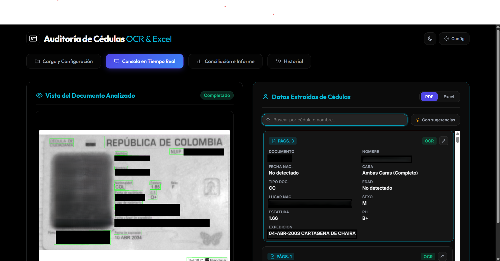
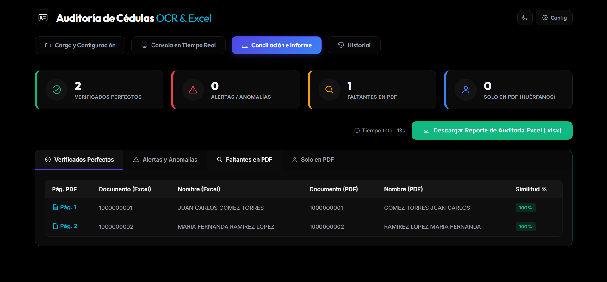

# Auditoría de Cédulas — OCR vs Excel 🆔🔍

### ⬇️ [**Descargar para Windows**](https://github.com/carvajal7lsch-commits/ocr_cruce/releases/download/v1.0.0/AuditoriaCedulas-Windows.zip)

No necesitas instalar Python, ni poppler, ni saber programar: descarga el `.zip` del
link de arriba, descomprímelo, y haz doble clic en `AuditoriaCedulas.exe`. Se abre
solo en tu navegador. Eso es todo.

---

Aplicación web para auditar documentos de identidad colombianos (cédulas, tarjetas de
identidad, cédulas de extranjería, contraseñas) escaneados en un PDF contra una base
de datos en Excel: lee cada página con OCR, cruza los datos contra el Excel por
documento y por nombre (con coincidencia difusa), y genera un reporte descargable con
los resultados clasificados en Verificados, Alertas, Faltantes y Huérfanos.




*(agrega tus propias capturas en `docs/` y actualiza las rutas de arriba)*

## ✨ Qué hace

- **OCR en lote**: procesa todas las páginas de un PDF en paralelo, con texto embebido
  (PyMuPDF) cuando el PDF ya lo trae y OCR real (RapidOCR) cuando no.
- **Extracción estructurada**: documento, nombre, fecha de nacimiento, tipo de
  documento (CC/TI/CE/Contraseña), lugar de nacimiento, sexo, estatura, RH y fecha/lugar
  de expedición — vía zona MRZ, posición de etiquetas en la plantilla, y un heurístico
  de respaldo, con filtros específicos para no confundir ruido de la plantilla
  (encabezados, firmas, nombre del registrador) con el nombre del titular.
- **Conciliación difusa contra Excel**: detecta automáticamente la fila de encabezado y
  las columnas de documento/nombre, y compara con `rapidfuzz` tolerando reordenamientos,
  palabras fusionadas por el OCR y nombres incompletos.
- **Fusión automática de páginas huérfanas**: cuando el anverso y el reverso de una
  misma cédula quedan separados porque una cara no dejó leer el número de documento,
  el sistema las reconecta solo por similitud de nombre — con una salvaguarda de
  cercanía de página para no arriesgarse a mezclar a dos personas distintas.
- **Consola en tiempo real** con vista del documento analizado, tarjetas editables,
  buscador por cédula/nombre y filtro de sugerencias pendientes.
- **Historial persistente** (SQLite) para reabrir auditorías anteriores sin volver a
  correr el OCR.
- **Reporte Excel** formateado por categoría, con el texto OCR crudo incluido para
  poder diagnosticar casos raros sin tener que re-procesar.
- **Modo claro/oscuro.**

## 🧱 Stack

Backend: FastAPI + Uvicorn · OCR: RapidOCR (ONNX) + PyMuPDF · PDF→imagen: pdf2image
(poppler) · Datos: pandas, openpyxl · Coincidencia difusa: rapidfuzz · Persistencia:
SQLite · Frontend: HTML/CSS/JS sin build step (sin frameworks).

---

## 🚀 Cómo correrlo

### Opción A — Ejecutable de Windows (sin instalar nada)

Es el botón de descarga de arriba. Un par de detalles adicionales:

- Al descomprimir, hay que mantener la carpeta `AuditoriaCedulas/` completa junta
  (no mover solo el `.exe` a otro lado, necesita los archivos de al lado para
  funcionar).
- Al abrirlo se ve una ventana de consola de fondo (normal, ahí se muestra el
  progreso) y el navegador se abre solo con la app.
- Los modelos de OCR ya vienen incluidos, así que no hace falta internet para usarlo.
- Si el puerto 8000 ya está ocupado por otra cosa en tu equipo, corre
  `set PORT=8001 && AuditoriaCedulas.exe` desde una consola en vez de hacerle doble clic.

### Opción B — Desde el código fuente (para desarrolladores)

Requiere Python 3.9+ y [Poppler](https://github.com/oschwartz10612/poppler-windows/releases)
instalado (o accesible por `PATH`, o apuntado con la variable de entorno
`POPPLER_PATH`).

```bash
# Windows / Linux / macOS
git clone <url-del-repo>
cd cruce_excel
pip install -r requirements.txt
python server.py
```

Se abre en `http://127.0.0.1:8000`. En Linux/macOS instala poppler con tu gestor de
paquetes (`apt install poppler-utils` / `brew install poppler`) antes de correrlo.

---

## 🛠️ Construir el ejecutable tú mismo

```bash
pip install pyinstaller
pyinstaller AuditoriaCedulas.spec
```

El resultado queda en `dist/AuditoriaCedulas/` — esa carpeta completa (no solo el
`.exe`) es lo que hay que distribuir. El `.spec` bundlea el frontend y, si existe en
tu máquina, el `bin` de Poppler (variable `POPPLER_BIN_SOURCE` en el `.spec` para
apuntar a tu instalación).

---

## 📁 Estructura

```
server.py           API (FastAPI) y orquestación del OCR
src/parser.py        Extracción de campos desde el texto OCR
src/ocr.py            Motor OCR (RapidOCR) y preprocesamiento de imagen
src/reporter.py       Generación del reporte Excel
src/db.py              Historial persistente (SQLite)
static/                Frontend (HTML/CSS/JS, sin build step)
```
